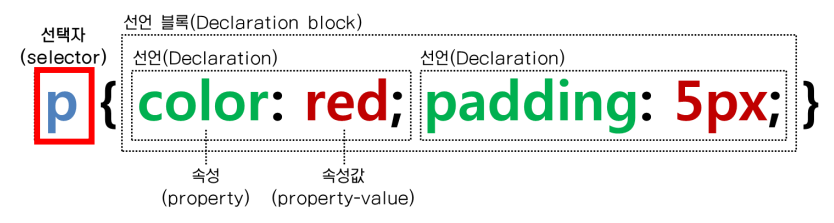
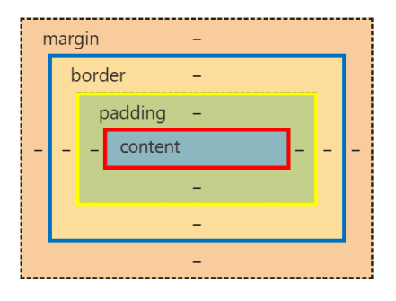

# 2024.05.22~

## CSS

### 1. CSS란?
> 웹 페이지를 디자인하기 위해 사용하는 언어

### 2. CSS 참조방식
  #### 1) 인라인 방식
  - 각 요소의 style 속성에 전부 스타일을 직접 적어줘야 함. 재사용 불가능
  ```html
    <h1 style="color: blue;">css 사용법</h1>
    <h2 style="color: blue; font-size: 50px;">css 사용법2</h1>
  ```
  #### 2) 내장 방식
  - HTML의 `<head>` 태그 내부에 사용할 Style을 `<style>` 태그로 미리 선언하여 사용!

  #### 3) 링크 방식
  - 모든 Style을 하나의 CSS 파일에 넣고, 필요한 HTML 파일에서 해당 파일을 링크해서 사용하는 방식

---

### 3. CSS 작성 구조


#### 1) 선택자
- CSS는 HTML 요소의 style을 정의하여야 하므로 스타일을 적용하고자 하는 HTML 요
소를 선택할 수 있어야 한다
#### 2) 속성(Property)
- 선택자로 HTML 요소를 선택하고 { } 내에 속성 값을 지정하여 다양한 style을 정의
- 여러 개의 프로퍼티를 연속해서 지정할 수 있으며 세미콜론(;)으로 구분
- 속성은 표준 스펙으로 이미 지정되어 있는 것을 사용, 사용자가 임의로 정의할 수 없다
#### 3) 값(Value)
- 값은 해당 속성에 사용할 수 있는 값을 키워드나 크기 단위 또는 색상 단위 등의 특정 단위로 지정

---  

### 4. 선택자 종류

#### 1) 단일 선택자
- `*` : 전체선택자 - 모든요소를 선택
- 태그선택자
- `.` : class선택자 - 한 요소에 여러 클래스 사용 가능, 공백으로 구분
- `#` : id선택자 - 한 요소에 하나의 아이디만 사용  

#### 2) 복합선택자
> 특수한 요소를 호출하고 싶을 때, 기본 선택자만으로는 선택이 불가능한 경우에 사용
- 띄어쓰기 : 하위선택자
- `>` : 자식선택자
- `+` : 인접형제선택자
- `~` : 일반형제선택자  

#### 3) 가상 클래스 선택자
  1. 사용자의 행동에 따라 변화 : hover, active, focus, visited
    - `:hover` - 요소에 마우스커서가 올라가 있는 동안
    - `:active` - 요소에 마우스를 클릭하고 있는 동안 
    - `:focus` - 요소에 포커스 상태
    - `:visited` - 방문했던 사이트  

  2. 요소의 상황 : first-child, last-child, nth-child, …
    - `:first-child`
    - `:last-child`
    - `:nth-child()`
      - odd : 홀수 번째 요소를 선택
      - even : 짝수 번째 요소를 선택
      - 2n+1 : odd와 같다. 홀수 번째 요소를 선택
      - 2n : even과 같다. 짝수 번째 요소를 선택
      - 5n : 5의 배수 번째 요소를 선택
      - 7 : 7번째 요소를 선택
      - n : 모든 요소를 선택

  3. 부정 선택 `:not()`  

#### 4) 가상 요소 선택자
> html 문서의 특정 부분을 스타일링 하기위해 사용 .실제로 html문서에 존재하지 않는 부분이지만  css통해 스타일 적용이 가능. 예를 들어 쇼핑몰 페이지에 메뉴에 Hot, 추천 등을 넣기 위해 별도의 태그를 삽입 하는 것이 아니라 가상 요소 선택자를 활용하여 처리하면 편리함

- `::after` - 요소의 뒤에 내용 삽입
- `::before` - 요소의 앞에 내용 삽입
- 반드시 content라는 속성을 사용. content 속성안에빈 값 이라도 넣어 주어야 적용이 된다  

#### 5) 속성선택자
>지정한 특정 속성을 가지고 있는 태그를 선택하는 선택자. 속성과 속성의 값을 지정가능
```css
  input[type="checkbox"]:checked+label[for="red"]{
      background-color: red;
  }
  input[type="checkbox"]:checked+label[for="blue"]{
      background-color: blue;
      color: #fff;
  }
  input[type="checkbox"]:checked+label[for="yellow"]{
      background-color: yellow;
  }
```
---

### 5. CSS 우선순위
> !important > 인라인 스타일 > 아이디 선택자 > 클래스/속성/가상 선택자 > 태그 선택자 > 전체 선택자

---

### 6. 자주 쓰이는 CSS 속성

---

### 7. CSS 여백

- margin
- padding

---

### 8. CSS 박스모델
#### box-sizing 속성
> 요소의 전체 너비와 높이를 어떻게 계산할지 결정  

#### 1. content-box
- 기본 값.
- 콘텐츠 영역을 기준으로 크기를 정함. (only content)
- padding, border는 이 크기에 추가로 더해짐.
- 장점
  - 콘텐츠 유연성 : 지정된 크기에 따라 동적 조정되므로 디자인의 유연성이 높다
  - 디자인제어 : 패딩, 테두리를 분리하여 디자인 요소를 더 정교하게 제어 가능
- 단점
  - 레이아웃이 복잡해진다 : 다 각각 계산해야 하므로 시간과 노력이 요구됨
  - 계산오류 가능성 : 별도로 계산하다가 오류가 발생할 확률이 높음

#### 2. border-box
- 콘텐츠 영역, padding, border를 포함한 총 크기를 지정.
- (content + padding + border)
- 장점
  - 예측가능성 : 총 너비와 높이가 예측하기 쉽다.
  - 유지보수, 간편한 계산 : 일관된 디자인, 별도로 계산할 필요가 없어짐.
- 단점
  - 내용공간감소 : 패딩과 테두리가 포함되므로 실제 콘텐츠 영역이 작아짐
  - 개발할때 더 선호 하는 방식

---

### 9. position
> 요소의 위치를 지정하는 css

- static : 정적 위치 지정 방식(기본값)  

- relative : 상대 위치 지정 방식
  - 일반적인 프름에 따라 배치, top/bottom/left/right 중 하나이상 작성
  - 원래있어야 하는 위치 기준으로 부터 이동한다
  - 위치가 바뀌어도 원래 기존 자리가 유지된다
  - 보통 부모 요소로 많이 사용한다

- absolute : 절대 위치 지정 방식
  - position 속성을 갖는 제일 가까운 조상을 기준 (static은 기준을 삼을수없음)
  - position 속성을 갖는 조상이 없다면 body기준
  - 특정 요소를 기준삼아서 top/bottom/left/right
  - 배치가 바뀌면 기존 자리가 없어진다

- fixed : 고정 위치 지정 방식
  - viewport(브라우저의 화면 전체)를 기준으로 특정위치
  - 스크롤이 되어도 움직이지 않음
  - header, footer에 많이 사용

-z-index
  - 겹치는 요소에 대한 순서를 결정
  - 숫자값 : 양수, 0. 음수 가능
  - 숫자값이 클수록 더 위에 쌓임(가장 앞에 놓인다

---

### 10. overflow
> 컨텐츠가 너무 크거나 길어서 크기보다 넘치게 될 때 사용하는 속성
- overflow-x : 수평방향으로 넘칠때 처리
- overflow-y : 수직방향으로 넘칠때 처리
- visivle(기본값) : 벗어난 부분을 표시한다
- hidden : 벗어난 부분을 숨긴다
- scroll : 스크롤 생성
- auto : 넘친다면 스크롤, 안넘치면 스크롤x

---

### 11. transform
- skew : 기울기
- scale : 확대
- rotate : 회전
- translate : 이동


### 12. transition
- transition-property 
- transition-duration 
- transition-timing-function 
- transition-delay
- 단축
  - transition: 속성명 지속시간 타이밍함수 대기시간;

### 13. display
- inline / block
- inline-block
- flex
- grid


